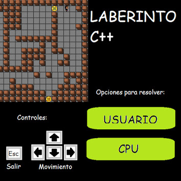

# Labyrinth game
A c++ labyrinth game i made in my first semester at university in 2015 using the allegro graphics library. The original assignment was to make just a text based game, but i wanted to add some graphics into it and well i got carried away.
- Manage of images and midi audio files.
- Level generation using data structures.
- Player or cpu solving.
- Basic menu.

